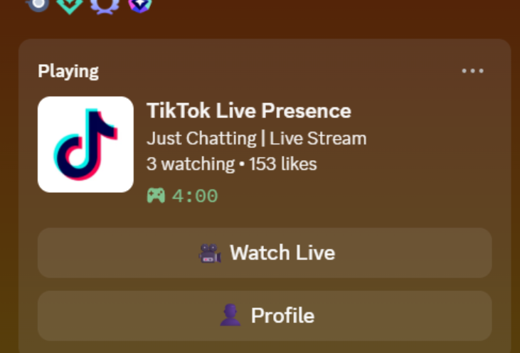

# TikTok Discord RPC Connector

Mirror your TikTok LIVE status to Discord Rich Presence.

[](https://github.com/foulfoxhacks/tiktok-discord-rpc/releases)
[](https://nodejs.org/)
[](https://www.typescriptlang.org/)
[](LICENSE)

A lightweight Node.js bridge that mirrors your TikTok LIVE status to Discord Rich Presence. While you're streaming, your Discord profile shows a "Playing" card with the stream title, viewer count, like count, and clickable buttons that take viewers straight to your live or profile.



## Key Features

- Detects when you go live and clears presence when the stream ends.
- Shows live viewer count, like count, and stream title.
- Adds Watch Live and Profile buttons to your Discord profile.
- Reconnects to TikTok after connection drops or stream end.
- Respects Discord's 15-second presence update rate limit.
- Configures everything through a single `.env` file.
- Uses Node.js and TypeScript with no native dependencies.

## Requirements

- Node.js 18 or later
- Discord desktop client running on the same machine
- A Discord application from the [Discord Developer Portal](https://discord.com/developers/applications)
- A public TikTok account with LIVE access

## Quick Start

```bash
git clone https://github.com/foulfoxhacks/tiktok-discord-rpc.git
cd tiktok-discord-rpc
npm install
cp .env.example .env
npm run dev
```

Edit `.env` before running:

```env
TIKTOK_USERNAME=your_tiktok_username
DISCORD_CLIENT_ID=your_discord_application_id
DISCORD_LARGE_IMAGE_KEY=tiktok_logo
```

Or build and run the compiled output:

```bash
npm run build
npm start
```

## Discord App Setup

1. Go to the [Discord Developer Portal](https://discord.com/developers/applications) and click **New Application**.
2. Give it the name you want to appear under "Playing", for example `TikTok Live Presence`.
3. From **General Information**, copy the **Application ID**. This is your `DISCORD_CLIENT_ID`.
4. Go to **Rich Presence -> Art Assets** and upload an image.
5. Name the asset key `tiktok_logo`, or set `DISCORD_LARGE_IMAGE_KEY` to the key you chose.

Discord caches assets, so newly uploaded images can take a few minutes to appear.

## How It Works

The script connects to TikTok's live room WebSocket via [`tiktok-live-connector`](https://www.npmjs.com/package/tiktok-live-connector) and listens for viewer and like events. It then pushes the latest state to the local Discord desktop client through [`discord-rpc`](https://www.npmjs.com/package/discord-rpc).

Update flow:

1. `rpc.login()` connects to the local Discord client over IPC.
2. Once Discord is ready, the TikTok connection opens.
3. Viewer, like, and title state are stored locally.
4. Every 15 seconds, the latest state is sent with `rpc.setActivity()`.
5. On stream end or disconnect, the Discord activity is cleared and TikTok reconnect is scheduled.

## Troubleshooting

**The activity card doesn't appear at all.**

Make sure Discord desktop is open and signed in. In Discord, enable **User Settings -> Activity Privacy -> Display current activity as a status message**. If the console shows `[Discord] Failed to connect to Discord RPC`, Discord is not running or local IPC is unavailable.

**The card shows but the buttons don't.**

Discord intentionally hides RPC buttons on your own profile. Have a friend or a second account view your profile to confirm they render. Buttons also do not show on Discord mobile.

**The image is missing or shows a placeholder.**

The asset key in `.env` must exactly match the key uploaded in the Discord Developer Portal. New assets can take several minutes to propagate.

**TikTok connection fails.**

`tiktok-live-connector` uses an unofficial API and can break when TikTok changes things. Check the package's [GitHub issues](https://github.com/zerodytrash/TikTok-Live-Connector/issues), and confirm your username is correct without the `@`.

## Development

```bash
npm install
npm run dev
npm run build
```

Source lives in `src/`, and compiled output is written to `dist/`.

## Changelog

- **v1.0.1** - Fix reconnect handling after TikTok disconnects, add package metadata, and clean README encoding.
- **v1.0.0** - Initial TikTok LIVE to Discord Rich Presence bridge with viewer count, like count, stream title, and Watch Live / Profile buttons.

## License

MIT - see [LICENSE](LICENSE).

## Contact

Created by **FoulFoxHacks**. Open issues or pull requests on GitHub: <https://github.com/foulfoxhacks/tiktok-discord-rpc>.
